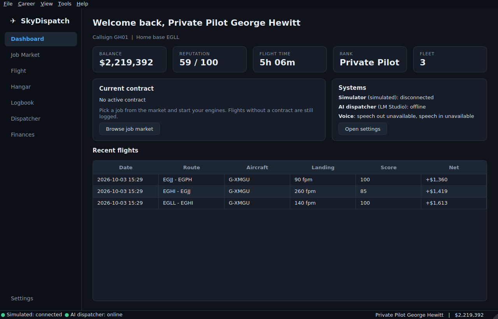
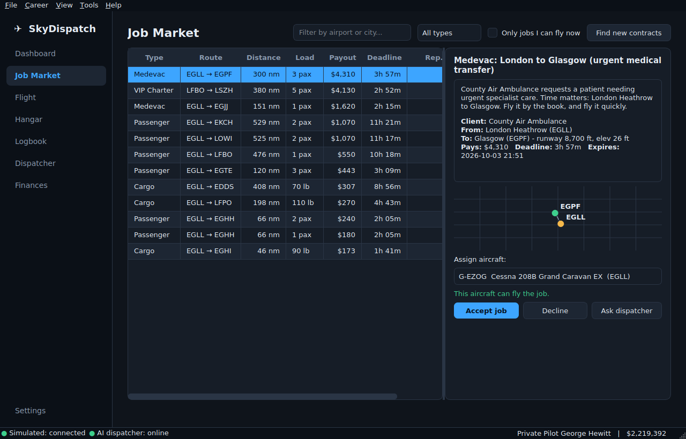
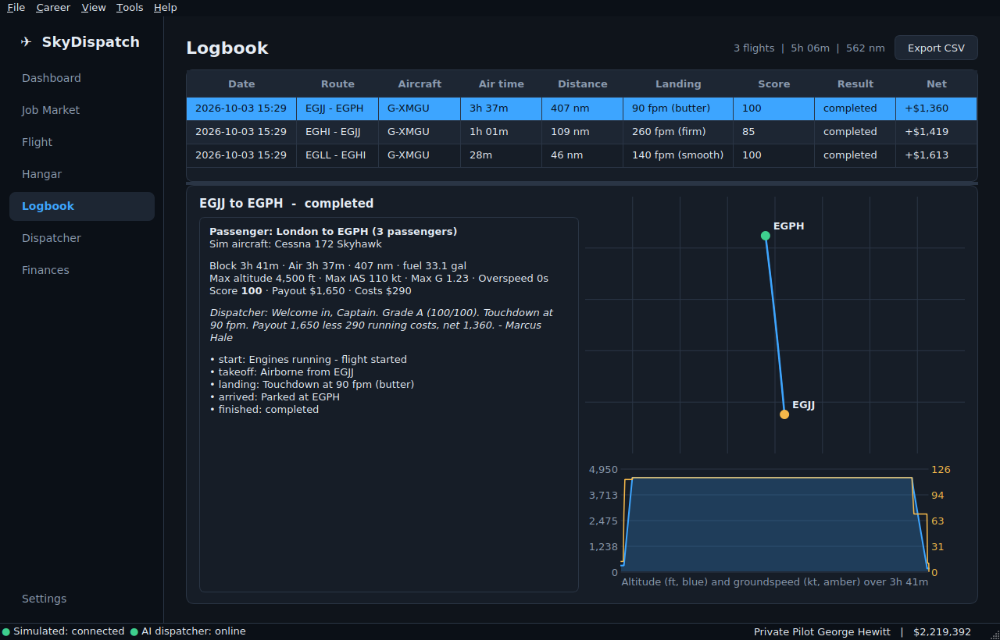
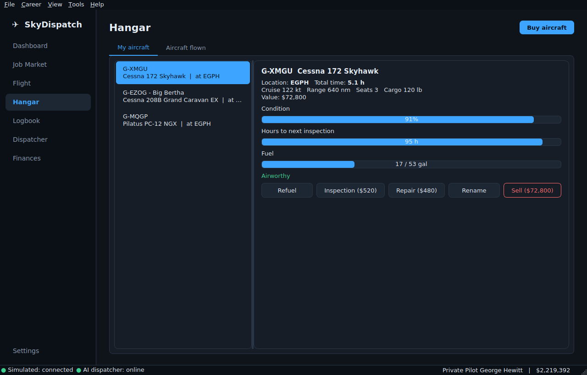
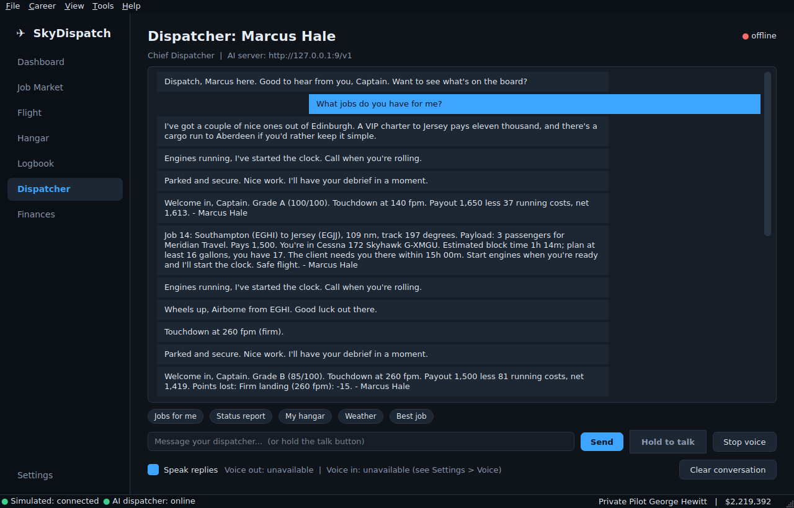

<h1 align="center">&#9992; SkyDispatch</h1>
<p align="center"><b>A career-mode add-on for Microsoft Flight Simulator 2020 &amp; 2024 with an AI flight dispatcher.</b><br>
Accept contracts, fly them in the sim, get paid for how you fly, grow a hangar, and talk to your dispatcher by voice.</p>

<p align="center"></p>

## Features

| | |
|---|---|
| **Job market** | A living board of passenger, cargo, VIP charter, medevac and mail contracts with payouts, deadlines, reputation gates and aircraft requirements. Accept or decline; the board refreshes itself. |
| **Automatic flight recording** | Connects to MSFS and records phases, takeoff and touchdown, landing rate, peak G, overspeed, fuel burn, distance, track and altitude profile into a local database. Free flights without a contract are logged too. |
| **Scoring &amp; economy** | Grades every flight (landing, G-load, overspeed, deadline, fuel, bounces, slew/teleport detection) and pays accordingly. Operating costs, resale value, reputation, XP and ranks. |
| **Hangar** | Buy new or used aircraft, refuel, inspect, repair and sell. Rough flying causes wear and damage; overdue inspections ground the aircraft. Every aircraft you ever fly in the sim is recorded in *Aircraft flown*. |
| **AI dispatcher** | A tool-calling agent powered by your **local LM Studio** server. Ask for jobs, weather, status or a hangar report, have it accept jobs and book maintenance. Four personalities, proactive radio calls during the flight, briefings and debriefs, AI-written contract text. |
| **Voice** | Hold-to-talk speech recognition (offline *faster-whisper*) and neural text-to-speech (offline *Piper*), with OS voices as a fallback. Optional global push-to-talk key that works while MSFS has focus. |
| **Desktop app** | Windows, macOS and Linux. First-run guided setup, full settings, backup &amp; restore, light/dark themes, CSV export. Native installers and uninstallers for each OS. |

<p align="center">
 <br>
 
</p>

## Install

Download the installer for your system from the **Releases** page:

| OS | File | Uninstall |
|----|------|-----------|
| Windows 10/11 | `SkyDispatch-Setup-x.y.z.exe` (guided installer) | Start menu &rarr; *Uninstall SkyDispatch*, or Settings &rarr; Apps (asks whether to keep your career data) |
| macOS 12+ | `SkyDispatch-x.y.z.pkg` (installer) or `.dmg` (drag to Applications) | Run *Uninstall SkyDispatch.command* |
| Linux | `skydispatch_x.y.z_amd64.deb` or `SkyDispatch-x.y.z-x86_64.AppImage` | Software centre / `sudo apt remove skydispatch`; delete the AppImage |

Builds are not code-signed yet: Windows SmartScreen and macOS Gatekeeper will warn on first launch
(*More info &rarr; Run anyway* / right-click &rarr; *Open*).

### From source
```bash
git clone https://github.com/SubduedGaming/MSFS-FlightDispatch && cd MSFS-FlightDispatch
python -m venv .venv && source .venv/bin/activate          # Windows: .venv\Scripts\activate
pip install -e ".[voice]"                                   # add ",sim" on Windows for live MSFS data
skydispatch                                                 # or: python -m skydispatch
```

## Quick start

1. **Run SkyDispatch.** The setup wizard asks for your pilot name, home airport, simulator link, AI server and voice, and gives you a starter aircraft.
2. **AI dispatcher:** install [LM Studio](https://lmstudio.ai), load an instruct model, start its local server, press *Test connection* in the wizard ([details](docs/AI_SETUP.md)).
3. **Simulator link:**
   - Windows with MSFS on the same PC: choose *Microsoft Flight Simulator*.
   - macOS/Linux, or a second PC: run the **SkyDispatch Bridge** next to MSFS and choose *Bridge* ([guide](docs/BRIDGE.md)).
   - No sim handy? Choose the *simulated flight engine* and press **Start demo flight** on the Flight tab.
4. Open **Job Market**, pick a contract and an aircraft in the right city, **Accept**.
5. In MSFS, start your engines. SkyDispatch starts the clock, flies along with you and pays out when you park at the destination.

## How the game works

- **Jobs** pay by distance and load, and are generated mostly for aircraft you own (some need something bigger). A job needs an aircraft of the right class, enough seats/cargo/range/runway, parked at the departure airport with enough fuel and in airworthy condition. Higher-value jobs need reputation.
- **Flights** start when an engine runs and the aircraft moves, and end when you park. Landing at the wrong airport voids the contract.
- **Score (0&ndash;100)** starts at 100 and loses points for hard landings, overspeed, G-load, bounces, lateness, low fuel and position jumps. Grade A pays +10%, below 75 pays less, below 50 much less. Difficulty (*relaxed / normal / realistic*) scales strictness and pay.
- **Aircraft** lose condition with hours and rough handling and need an inspection every 100&ndash;500 hours. Fuel is part of the economy: refuel in the hangar before long trips.

## Where your data lives

| | Windows | macOS | Linux |
|---|---|---|---|
| Career database &amp; settings | `%LOCALAPPDATA%\SkyDispatch\SkyDispatch` | `~/Library/Application Support/SkyDispatch` | `~/.local/share/SkyDispatch`, `~/.config/SkyDispatch` |
| Logs | `...\Logs` | `~/Library/Logs/SkyDispatch` | `~/.local/state/SkyDispatch/log` |

Settings &rarr; *Data and Backup* creates/restores backups, imports the worldwide airport database
([OurAirports](https://ourairports.com/data/), public domain) and resets the career. Set `SKYDISPATCH_HOME` to relocate everything (portable use).
API keys and bridge tokens are stored in plain text in `settings.json`, like most desktop apps; they never leave your machine except to the servers you configure.

## Development

```bash
pip install -e ".[dev]"
pytest                      # headless (Qt offscreen); ~1 minute
python packaging/build.py   # build the native installer for this OS (docs/BUILDING.md)
```

```
src/skydispatch/
  career.py        rules engine: accept jobs, record flights, settle pay and wear
  db/              SQLite schema, migrations, queries
  sim/             SimConnect provider, network bridge (client + server), simulated engine
  flight/          recorder (phases/events) and scoring
  jobs/ hangar/    market generation, pricing, fleet and maintenance
  ai/              LM Studio client, dispatcher agent, tools, personas, briefings
  voice/           faster-whisper STT, Piper/system TTS, push-to-talk
  ui/              PySide6 desktop app: pages, wizard, theme, dialogs
packaging/         PyInstaller spec, Inno Setup, macOS dmg/pkg, Linux deb/AppImage
tests/             unit + GUI + end-to-end tests
```

## Status and known limits

- Tested automatically on Linux (unit, GUI and end-to-end flight tests with the simulated engine, a real socket bridge
  test, and a frozen-app + `.deb` smoke test). The Windows/macOS GUI, the SimConnect link to a **real** MSFS, the
  Windows/macOS installers, and real Piper/Whisper audio are built to the libraries' documented APIs but have **not**
  been exercised on those systems in this repository yet. The CI workflows run the test-suite on all three OSes.
- Weather uses the public aviationweather.gov METAR API when internet is available.
- The airport database ships with 180 major airports; import the full OurAirports set for worldwide coverage.

## License

Apache License 2.0. SkyDispatch is an independent project and is not affiliated with or endorsed by Microsoft or Asobo Studio.
